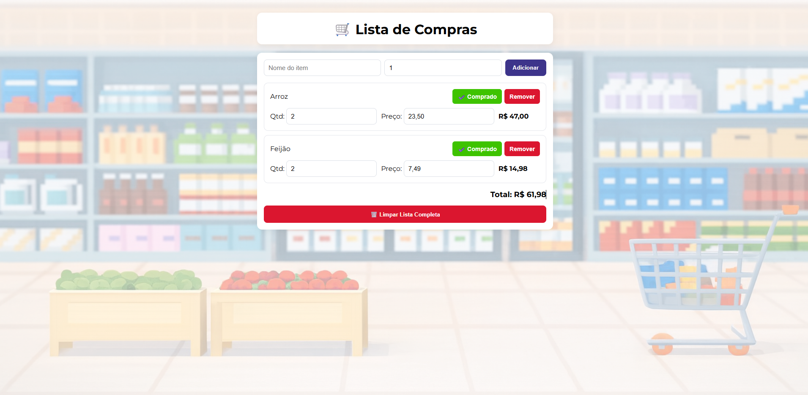

🛒 Lista de Compras — Ana Carolina Marchesini
📌 Sobre o Projeto

A ideia deste aplicativo surgiu ao perceber que a maioria das pessoas utiliza o celular diariamente para organizar tarefas — e que a ida ao mercado pode ser muito mais prática com uma lista digital.

O objetivo é criar uma experiência simples, rápida e funcional, permitindo ao usuário:

Registrar o que precisa comprar

Controlar quantidades e preços

Marcar itens já comprados

Visualizar o valor total atualizado automaticamente

Usar tudo diretamente do navegador, inclusive no celular

🎨 Design & Estilo

As cores foram criadas utilizando o gerador de paletas do Coolors:
🔗 https://coolors.co/?home

A imagem de fundo foi criada por Inteligência Artificial, trazendo um visual estilizado e coerente com o tema do projeto.

🧩 Funcionalidades

➕ Adicionar itens com nome, quantidade e preço

✏️ Editar quantidade e preço diretamente na lista

✔️ Marcar itens como comprados

🗑️ Remover itens individualmente

🔄 Botão para limpar toda a lista (com confirmação)

💰 Total da compra calculado automaticamente

📱 Layout totalmente responsivo para celulares

♿ Acessibilidade aprimorada com ARIA e navegação por teclado

♿ Acessibilidade

O projeto foi desenvolvido com foco na inclusão, incorporando:

aria-label e aria-live para leitores de tela

Foco visível aprimorado

Labels ocultas (sr-only) mantendo acessibilidade sem poluir o layout

Conteúdo dinâmico que respeita tecnologias assistivas

Estrutura semântica para melhor navegação

🧪 Preview do Projeto

Adicione aqui uma imagem, GIF ou vídeo demonstrando o funcionamento do app.

🛠 Tecnologias Utilizadas

HTML5

CSS3

JavaScript (ES6+)

Google Fonts — Montserrat

👩‍💻 Autora

Ana Carolina Marchesini
Aplicação criada com foco em praticidade, acessibilidade e experiência mobile.
